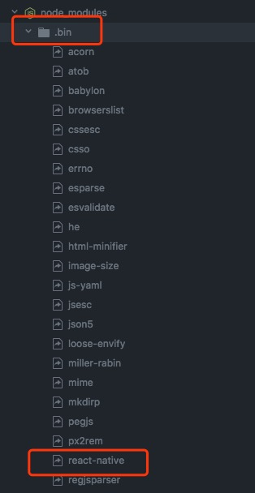

# package.json

## 以react-native的package.json 为例

### name version
package.json中最重要的属性是name和version两个属性，这两个属性是必须要有的，否则模块就无法被安装，这两个属性一起形成了一个npm模块的唯一标识符。模块中内容变更的同时，模块版本也应该一起变化。

### description
一句话描述你的组件，方便别人了解你的模块作用，搜索的时候也有用。

### keywords
一个字符串数组，方便别人搜索到你的模块

### homepage
项目的主页url，比如react-native的homepage为
```
"homepage": "https://github.com/facebook/react-native#readme"
```
### bugs
填写一个bug提交地址或者一个邮箱，被你的模块坑到的人可以通过这里吐槽，例如

```
"bugs": {
    "url": "https://github.com/facebook/react-native/issues"
  }
```
url和email可以任意填或不填，如果只填一个，可以直接写成一个字符串而不是对象。如果填写了url，npm bugs命令会使用这个url。

### license

```
"license": "BSD-3-Clause"
```

### author, contributors

如果是一个人写的，author就是一个人。如果一个团队，可使用contributors，是个数组。里面是一组人名。

### files

"files"属性的值是一个**数组**，内容是模块下文件名或者文件夹名，如果是文件夹名，则文件夹下所有的文件也会被包含进来（除非文件被另一些配置排除了）
你也可以在模块根目录下创建一个".npmignore"文件，写在这个文件里边的文件即便被写在files属性里边也会被排除在外，这个文件的写法".gitignore"类似。

```
"files": [
    ".flowconfig",
    "android",
    "cli.js",
    "flow",
    "init.sh",
    "ios-cc.sh",
    "ios-install-third-party.sh",
    "jest-preset.json",
    "jest",
    "lib",
    "setupBabel.js",
    "Libraries",
    "LICENSE",
    "local-cli",
    "packager",
    "PATENTS",
    "react.gradle",
    "React.podspec",
    "React",
    "ReactAndroid",
    "ReactCommon",
    "README.md",
    "third-party-podspecs"
  ]
```
### main
main属性指定了程序的主入口文件。意思是，如果你的模块被命名为foo，用户安装了这个模块并通过require("foo")来使用这个模块，那么require返回的内容就是main属性指定的文件中 module.exports指向的对象。
它应该指向模块根目录下的一个文件。对大对数模块而言，这个属性更多的是让模块有一个主入口文件，然而很多模块并不写这个属性。
```
  "main": "Libraries/react-native/react-native-implementation.js"
```
### bin
很多模块有一个或多个需要配置到**PATH**路径下的可执行模块，npm让这个工作变得十分简单（实际上npm本身也是通过bin属性安装为一个可执行命令的）
如果要用npm的这个功能，在package.json里边配置一个bin属性。bin属性是一个已命令名称为key，本地文件名称为value的map如下：

```
"bin": {
    "react-native": "local-cli/wrong-react-native.js"
  }
```
模块安装的时候，若是全局安装，则npm会为bin中配置的文件在bin目录下创建一个软连接（对于windows系统，默认会在C:\Users\username\AppData\Roaming\npm目录下），若是局部安装，则会在项目内的./node_modules/.bin/目录下创建一个软链接。



### man

制定一个或通过数组制定一些文件来让linux下的man命令查找文档地址。
如果只有一个文件被指定的话，安装后直接使用man+模块名称，而不管man指定的文件的实际名称。例如:
```
{ "name" : "foo"
, "version" : "1.2.3"
, "description" : "A packaged foo fooer for fooing foos"
, "main" : "foo.js"
, "man" : "./man/doc.1"
}
```
通过man foo命令会得到 ./man/doc.1 文件的内容。

### repository

指定一个代码存放地址，对想要为你的项目贡献代码的人有帮助。
```
"repository" :
  { "type" : "git"
  , "url" : "https://github.com/npm/npm.git"
  }

"repository" :
  { "type" : "svn"
  , "url" : "https://v8.googlecode.com/svn/trunk/"
  }

//react-native 的如下
"repository": {
    "type": "git",
    "url": "git+ssh://git@github.com/facebook/react-native.git"
  }
```

若你的模块放在GitHub, GitHub gist, Bitbucket, or GitLab的仓库里，npm install的时候可以使用缩写标记来完成

```
"repository": "npm/npm"

"repository": "gist:11081aaa281"

"repository": "bitbucket:example/repo"

"repository": "gitlab:another/repo"
```
### scripts

scripts属性是一个对象，里边指定了项目的生命周期个各个环节需要执行的命令。key是生命周期中的事件，value是要执行的命令。

```
//rn

"scripts": {
    "flow": "flow",
    "lint": "eslint RNTester/ Libraries/",
    "start": "/usr/bin/env bash -c './packager/packager.sh \"$@\" || true' --",
    "test": "jest",
    "test-android-all": "npm run test-android-build && npm run test-android-run-unit && npm run test-android-run-instrumentation && npm run test-android-run-e2e",
    "test-android-build": "docker build -t react/android -f ContainerShip/Dockerfile.android .",
    "test-android-e2e": "npm run test-android-build && npm run test-android-run-e2e",
    "test-android-instrumentation": "npm run test-android-build && npm run test-android-run-instrumentation",
    "test-android-run-e2e": "docker run --privileged -it react/android bash ContainerShip/scripts/run-ci-e2e-tests.sh --android --js",
    "test-android-run-instrumentation": "docker run --cap-add=SYS_ADMIN -it react/android bash ContainerShip/scripts/run-android-docker-instrumentation-tests.sh",
    "test-android-run-unit": "docker run --cap-add=SYS_ADMIN -it react/android bash ContainerShip/scripts/run-android-docker-unit-tests.sh",
    "test-android-setup": "docker pull containership/android-base:latest",
    "test-android-unit": "npm run test-android-build && npm run test-android-run-unit"
  }
```
### config

用来设置一些项目不怎么变化的项目配置，例如port等。

```
{ "name" : "foo",
  "config" : { "port" : "8080" }
}
```
用户用的时候可以使用如下用法：

```
http.createServer(...).listen(process.env.npm_package_config_port)
```
### dependencies

dependencies属性是一个对象，配置模块依赖的模块列表，key是模块名称，value是版本范围，版本范围是一个字符，可以被一个或多个空格分割。
dependencies也可以被指定为一个git地址或者一个压缩包地址。
不要把测试工具或transpilers写到dependencies中。

### devDependencies

如果有人想要下载并使用你的模块，也许他们并不希望或需要下载一些你在开发过程中使用的额外的测试或者文档框架。
在这种情况下，最好的方法是把这些依赖添加到devDependencies属性的对象中。
这些模块会在npm link或者npm install的时候被安装，也可以像其他npm配置一样被管理，详见npm的config文档。
对于一些跨平台的构建任务，例如把CoffeeScript编译成JavaScript，就可以通过在package.json的script属性里边配置prepublish脚本来完成这个任务，然后需要依赖的coffee-script模块就写在devDependencies属性种。

```
{ "name": "ethopia-waza",
  "description": "a delightfully fruity coffee varietal",
  "version": "1.2.3",
  "devDependencies": {
    "coffee-script": "~1.6.3"
  },
  "scripts": {
    "prepublish": "coffee -o lib/ -c src/waza.coffee"
  },
  "main": "lib/waza.js"
}
```
prepublish脚本会在发布之前运行，因此用户在使用之前就不用再自己去完成编译的过程了。在开发模式下，运行npm install也会执行这个脚本（见npm script文档），因此可以很方便的调试。

### peerDependencies

通常是在插件开发的场景下，你的插件需要某些依赖的支持，但是你又没必要去安装，因为插件的宿主会去安装这些依赖，你就可以用peerDependencies去声明一下需要依赖的插件和版本，如果出问题npm就会有警告来提醒使用者去解决版本冲突问题
在npm1和2的版本中，peerDependencies是会被自动安装的，但是在npm3的版本中不会自动安装，只会有警告。

```
//例如 rn

"peerDependencies": {
  "react": "16.0.0-alpha.12"
}
```
### bundledDependencies
指定发布的时候会被一起打包的模块。

### optionalDependencies

如果一个依赖模块可以被使用， 同时你也希望在该模块找不到或无法获取时npm继续运行，你可以把这个模块依赖放到optionalDependencies配置中。这个配置的写法和dependencies的写法一样，不同的是这里边写的模块安装失败不会导致npm install失败。
当然，这种模块就需要你自己在代码中处理模块确实的情况了，例如：

```
try {
  var foo = require('foo')
  var fooVersion = require('foo/package.json').version
} catch (er) {
  foo = null
}
if ( notGoodFooVersion(fooVersion) ) {
  foo = null
}

// .. then later in your program ..

if (foo) {
  foo.doFooThings()
}
```

**optionalDependencies 中的配置会覆盖dependencies中的配置，最好只在一个地方写。**

### engines

你可以指定项目运行的node版本范围，如下：
{ "engines" : { "node" : ">=0.10.3 <0.12" } }
和dependencies一样，如果你不指定版本范围或者指定为*，任何版本的node都可以。
也可以指定一些npm版本可以正确的安装你的模块，例如：
{ "engines" : { "npm" : "~1.0.20" } }
要注意的是，除非你设置了engine-strict属性，engines属性是仅供参考的。

```
"engines": {
  "node": ">=4"
}
```

### os

可以指定你的模块只能在哪个操作系统上跑：
"os" : [ "darwin", "linux" ]
也可以指定黑名单而不是白名单：
"os" : [ "!win32" ]
服务的操作系统是由process.platform来判断的，这个属性允许黑白名单同时存在，虽然没啥必要这样搞...

### cpu
限制模块只能在某某cpu架构下运行
"cpu" : [ "x64", "ia32" ]
同样可以设置黑名单:
"cpu" : [ "!arm", "!mips" ]
cpu架构通过 process.arch 判断

### private

如果这个属性被设置为true，npm将拒绝发布它，这是为了防止一个私有模块被无意间发布出去。如果你只想让模块被发布到一个特定的npm仓库，如一个内部的仓库，可与在下面的publishConfig中配置仓库参数。

### publishConfig
这个配置是会在模块发布时用到的一些值的集合。如果你不想模块被默认被标记为最新的，或者默认发布到公共仓库，可以在这里配置tag或仓库地址。

### DEFAULT VALUES

npm设置了一些默认参数，如：
"scripts": {"start": "node server.js"}
如果模块根目录下有一个server.js文件，那么npm start会默认运行这个文件。
"scripts":{"preinstall": "node-gyp rebuild"}
如果模块根目录下有binding.gyp, npm将默认用node-gyp来编译preinstall的脚本
"contributors": [...]
若模块根目录下有AUTHORS 文件，则npm会按Name (url)格式解析每一行的数据添加到contributors中，可以用#添加行注释
